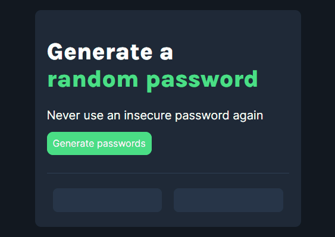

# Password Generator

The object is to get a hand with a value as close to 21 as possible without going over.

**Link to project:**

## How's it made

**Tech used:** HTML, CSS, JavaScript

## Lessons Learned:

Most of these were a good refresher for:

- Working with arrays
- how to create random numbers with the Math object
- more practice with for loops
- flexbox for layouts
